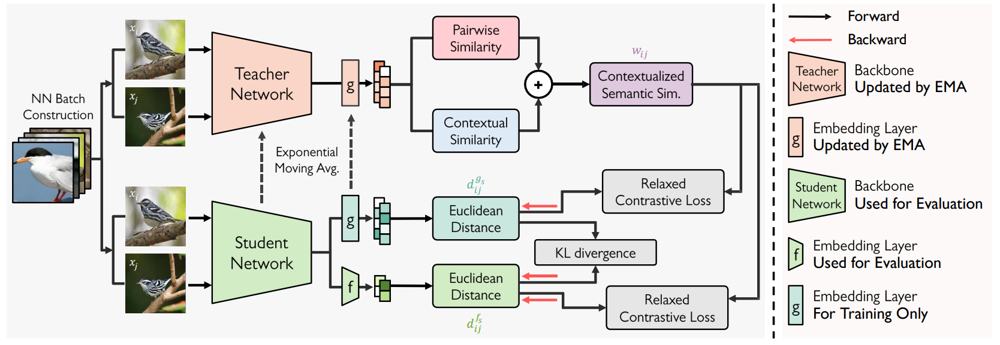
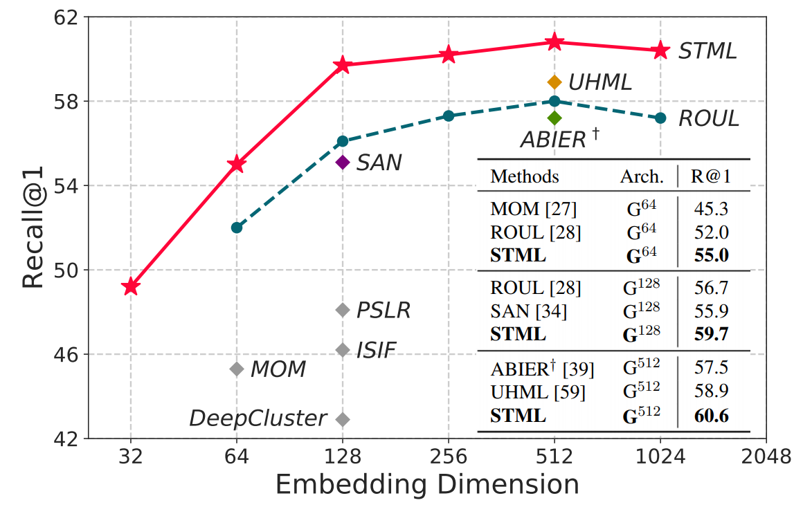

# Self-Taught Metric Learning without Labels

Official PyTorch implementation of CVPR 2022 paper [**Self-Taught Metric Learning without Labels**](https://arxiv.org/abs/2205.01903). 

A standard embedding network trained with **Self-Taught Metric Learning framework(STML)** achieves SOTA performance on unsupervised metric learning
 and sometimes even beats supervised learning models.

This repository provides source code of unsupervised metric learning experiments on three datasets (CUB-200-2011, Cars-196, Stanford Online Products).

## Overview

### Self-Taught Metric Learning
- 1. The contextualized semantic similarity between a pair of data is estimated on the embedding space of the teacher network. 
- 2. The semantic similarity is then used as a pseudo label, and the student network is optimized by relaxed contrastive loss with KL divergence.
- 3. The teacher network is updated by an exponential moving average of the student. The student network learns by iterating these steps a number of times, and its backbone and embedding layer in light green are considered as our final model.
  
<p align="center"></p>

### Experimental Restuls
- Our model with 128 embedding dimensions outperforms all previous arts using higher embedding dimensions and sometimes surpasses supervised learning methods. 

<p align="center"></p>
## Requirements

- Python3
- PyTorch (> 1.0)
- NumPy
- tqdm
- wandb

## Datasets

1. Download four public benchmarks for deep metric learning
   - [CUB-200-2011](http://www.vision.caltech.edu/visipedia-data/CUB-200-2011/CUB_200_2011.tgz)
   - Cars-196 ([Img](http://imagenet.stanford.edu/internal/car196/car_ims.tgz), [Annotation](http://imagenet.stanford.edu/internal/car196/cars_annos.mat))
   - Stanford Online Products ([Link](https://cvgl.stanford.edu/projects/lifted_struct/))

2. Extract the tgz or zip file into `./data/` (Exceptionally, for Cars-196, put the files in a `./data/cars196`)

## Training Target Embedding Network

### CUB-200-2011 (Unsupervised)

- Train a target embedding network with GoogLeNet (d=512) using STML

```bash
python3 code/main.py --gpu-id 0 \
                        --model googlenet \
                        --embedding_size 512 \
                        --optimizer adamp \
                        --lr 1e-4 \
                        --dataset cub \
                        --view 2 \
                        --sigma 3 \
                        --delta 1 \
                        --IPC 5
```

- Train a target embedding network with BN-Inception (d=512) using STML

```bash
python3 code/main.py --gpu-id 0 \
                        --model bn_inception \
                        --embedding_size 512 \
                        --optimizer adamp \
                        --lr 1e-4 \
                        --dataset cub \
                        --view 2 \
                        --sigma 3 \
                        --delta 1 \
                        --IPC 5 \
                        --bn-freeze 1
```

### Cars-196 (Unsupervised)

- Train a target embedding network with GoogLeNet (d= 512) using STML

```bash
python3 code/main.py --gpu-id 0 \
                        --model googlenet \
                        --embedding_size 512 \
                        --optimizer adamp \
                        --lr 1e-4 \
                        --dataset cars \
                        --view 2 \
                        --sigma 3 \
                        --delta 1 \
                        --IPC 5
```

- Train a target embedding network with BN-Inception (d=512) using STML 

```bash
python3 code/main.py --gpu-id 0 \
                        --model bn_inception \
                        --embedding_size 512 \
                        --optimizer adamp \
                        --lr 1e-4 \
                        --dataset cars \
                        --view 2 \
                        --sigma 3 \
                        --delta 1 \
                        --IPC 5 \
                        --bn-freeze 1
```

### Stanford Online Products (Unsupervised)

- Train a target embedding network with GoogLeNet (d= 512) using STML

```bash
python3 code/main.py --gpu-id 0 \
                        --model bn_inception \
                        --embedding_size 512 \
                        --optimizer adamp \
                        --lr 1e-4 \
                        --dataset SOP \
                        --view 2 \
                        --sigma 3 \
                        --delta 0.9 \
                        --IPC 2 \
                        --momentum 0.9
```

- Train a target embedding network with BN-Inception (d=512) using STML 

```bash
python3 code/main.py --gpu-id 0 \
                        --model bn_inception \
                        --embedding_size 512 \
                        --optimizer adamp \
                        --lr 1e-4 \
                        --dataset SOP \
                        --view 2 \
                        --sigma 3 \
                        --delta 0.9 \
                        --IPC 2 \
                        --momentum 0.9 \
                        --bn_freeze 1
```

### Stanford Online Products (Unsupervised & From Scratch)

- Train a target embedding network with ResNet18 (d=128) using STML 

```bash
python3 code/main.py --gpu-id 0 \
                        --model resnet18 \
                        --embedding_size 128 \
                        --optimizer adamp \
                        --lr 5e-4 \
                        -- fix_lr true \
                        --dataset SOP \
                        --view 2 \
                        --sigma 3 \
                        --delta 0.9 \
                        --IPC 2 \
                        --momentum 0.9 \
                        --pretrained false \
                        --weight-decay 1e-2 \
                        --batch-size 120 \
                        --epoch 180
```

## Acknowledgements

Our source code is modified and adapted on these great repositories:

- [Embedding Transfer with Label Relaxation for Improved Metric Learning](https://github.com/tjddus9597/LabelRelaxation-CVPR21)
- [Proxy Anchor Loss for Deep Metric Learning](https://github.com/tjddus9597/Proxy-Anchor-CVPR2020)
- [No Fuss Distance Metric Learning using Proxies](https://github.com/dichotomies/proxy-nca)
- [PyTorch Metric learning](https://github.com/KevinMusgrave/pytorch-metric-learning)


## Citation

If you use this method or this code in your research, please cite as:

    @inproceedings{kim2022self,
      title={Self-Taught Metric Learning without Labels},
      author={Kim, Sungyeon and Kim, Dongwon and Cho, Minsu and Kwak, Suha},
      booktitle={Proceedings of the IEEE Conference on Computer Vision and Pattern Recognition},
      year={2022}
    }